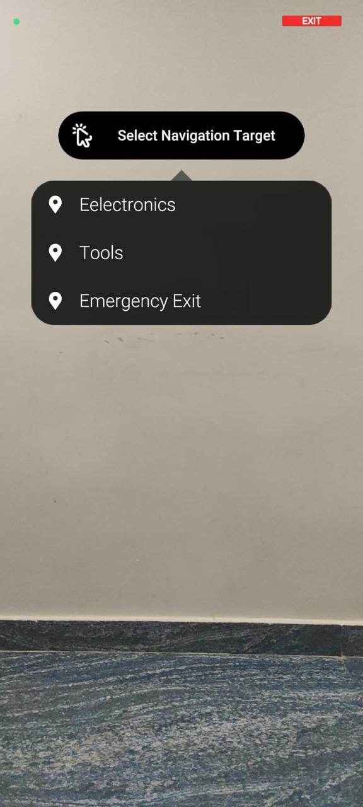
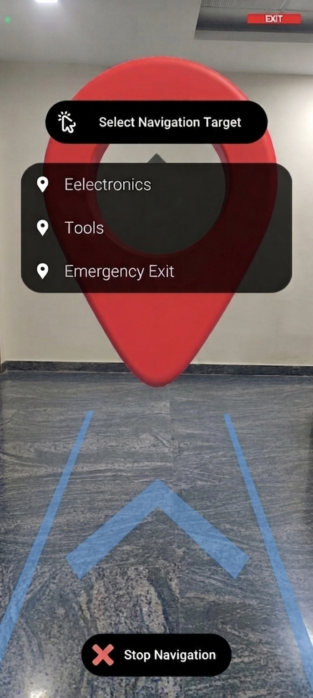

# AR-Based Indoor Navigation System for Industrial Workers

An Augmented Reality (AR) application designed to improve warehouse logistics by providing real-time indoor navigation and intelligent item placement guidance for industrial workers.

## Overview

This project enables warehouse workers to quickly locate storage locations and navigate efficiently inside indoor warehouse environments using Augmented Reality.

Workers can select an item category, such as Electronics, and the system automatically identifies the correct storage or drop-off location while displaying AR navigation cues in real time.

The application aims to reduce search time, improve operational efficiency, and enhance worker spatial awareness.

---

## Features

- AR-based indoor navigation
- Category-based item selection
- Automatic storage location identification
- Drop-off location guidance
- Real-time AR visual indicators
- Warehouse logistics workflow support
- Improved worker efficiency and navigation accuracy

---

## Technologies Used

- Unity
- AR Foundation
- ARCore
- C#
- XR Interaction Toolkit
- Android

---

## How It Works

1. Launch the application.
2. Select an item category (e.g., Electronics).
3. The system identifies the corresponding storage location.
4. AR navigation arrows and visual cues guide the worker.
5. Reach the destination and complete the storage or retrieval task.

---

## Project Architecture

```
User
   │
   ▼
Item Category Selection
   │
   ▼
Storage Location Mapping
   │
   ▼
Indoor Navigation Engine
   │
   ▼
AR Visual Guidance
   │
   ▼
Destination Reached
```

---

## Applications

- Smart Warehouses
- Inventory Management
- Industrial Logistics
- Manufacturing Facilities
- Distribution Centers

---

## Future Improvements

- QR/Markerless indoor localization
- AI-based route optimization
- Multi-floor warehouse support
- Voice-guided navigation
- Real-time inventory integration
- IoT-enabled shelf tracking

---

## XR Showcase

🎮 **Live Demo:** [Try the project on itch.io](https://vvinay06.itch.io/ar-based-indoor-navigation-system-for-industrial-workers)

---

## Screenshots

<p align="center">
  
  
</p>


